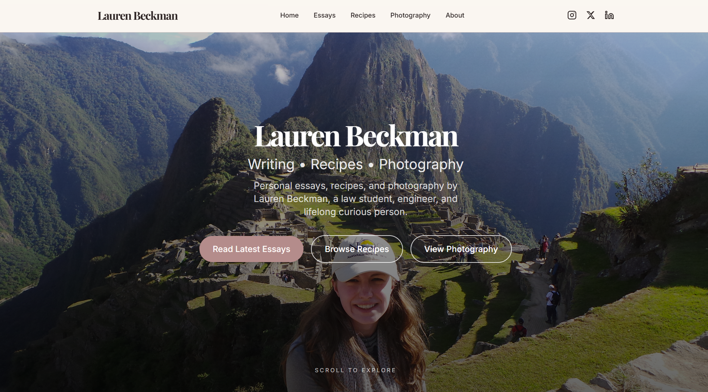

# LaurenEBeckman.com

My personal website that is a home for my writing, recipes, and photography.

## ✨ Live Site
[→ Visit laurenebeckman.com](https://laurenebeckman.com/)

## What You'll Find
- **Essays**: Thoughtful writing on life, creativity, and everything in between
- **Recipes**: The ones I actually make and love
- **Photography**: Moments I've captured

## Tech Stack
- [Astro](https://astro.build): static site framework
- Tailwind CSS v4: utility-first styling
- Playfair Display + Inter (typography)
- RSS/Atom feed integration
- Vercel (hosting)
- Porkbun (custom domain)

## Features
- Server-side Substack RSS feed integration
- Fully-responsive, mobile-first design
- Custom favicon and brand palette
- Instagram photography grid
- SEO-friendly with sitemap

## Development
This is the **public version** of my website. My full development history lives in a separate private repo.

Made with ❤️ by Lauren Beckman
